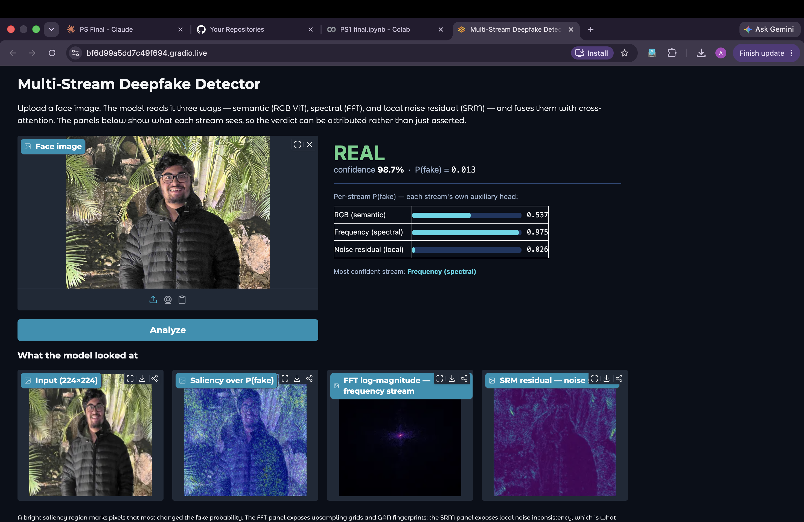

# Demo UI

Upload a face image, get a verdict plus the evidence behind it.



## Run

```bash
pip install gradio
python app/app.py --ckpt runs/fusion/best.pt
```

Opens on `http://localhost:7860`.

In Colab, add `--share` to get a public link:

```python
!python app/app.py --ckpt /content/drive/MyDrive/PS1/runs/fusion/best.pt --share
```

## What it shows

**Verdict** — real or fake, with confidence and the raw P(fake).

**Per-stream confidence** — each encoder keeps an auxiliary classification head from
training, so the app can report what the RGB, frequency, and noise streams each thought on
their own. This is the interesting part: on a fully-synthesized face all three usually agree,
but on a FaceApp-style local edit the RGB stream is often unconvinced while the noise
residual stream is the one that catches it.

**Saliency** — gradient of P(fake) with respect to the input, so bright regions are the
pixels that most moved the decision.

**FFT log-magnitude** — the spectrum the frequency stream reads. Upsampling artifacts from
GAN generators show up here as regular structure.

**SRM residual** — the high-pass noise map the noise stream reads. Splices and re-rendered
regions break the local noise consistency of a photo, which is what this exposes.

## Note on preprocessing

The app feeds the model raw `[0,1]` tensors at 224×224, exactly like `data.py` does at
training time. Don't add ImageNet normalization here — the RGB encoder applies it internally,
and normalizing early would corrupt what the FFT and SRM streams read.
